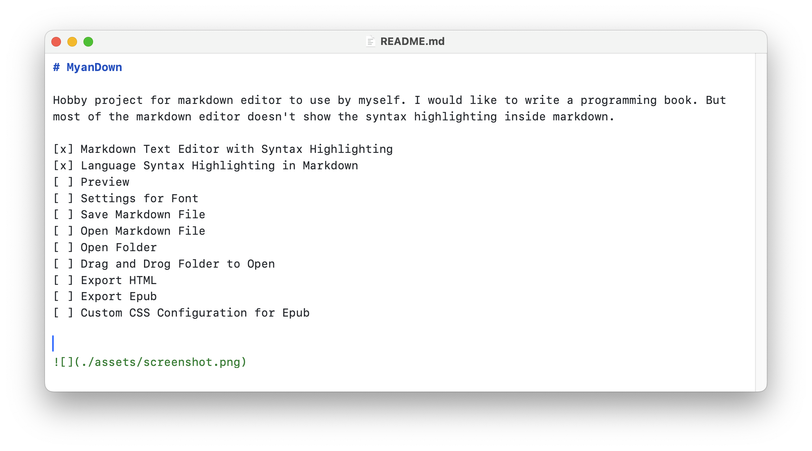

# MyanDown

Hobby project for markdown editor to use by myself. I would like to write a programming book. But most of the markdown editor doesn't show the syntax highlighting inside markdown.

[x] Markdown Text Editor with Syntax Highlighting
[x] Language Syntax Highlighting in Markdown
[ ] Preview
[ ] Settings for Font
[ ] Save Markdown File
[ ] Open Markdown File
[ ] Open Folder
[ ] Drag and Drog Folder to Open
[ ] Export HTML
[ ] Export Epub
[ ] Custom CSS Configuration for Epub

