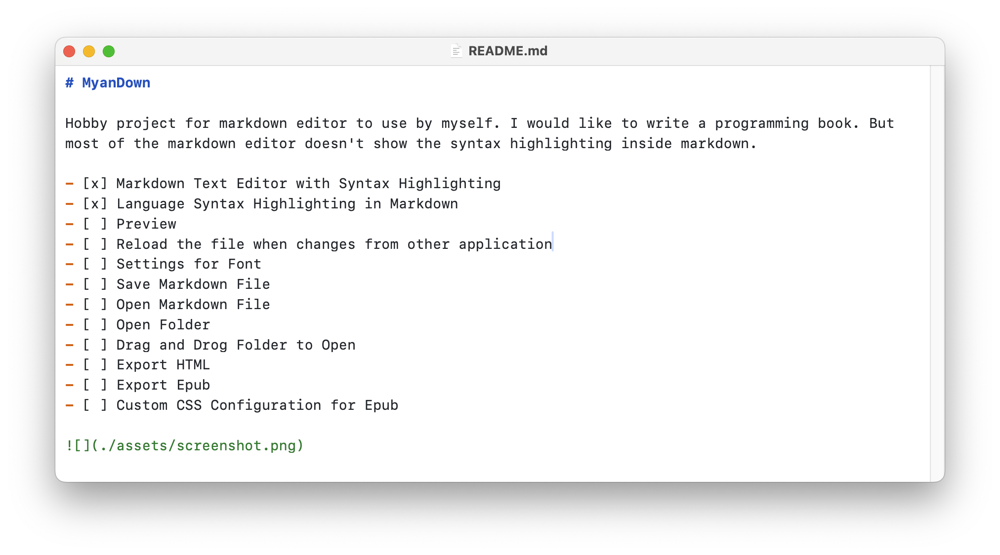

# MyanDown

Hobby project for markdown editor to use by myself. I would like to write a programming book. But most of the markdown editor doesn't show the syntax highlighting inside markdown.

- [x] Markdown Text Editor with Syntax Highlighting
- [x] Use the VSCode Theme JSON file for markdown theme
- [x] Language Syntax Highlighting in Markdown
- [X] Save Markdown File
- [X] Open Markdown File
- [ ] Drag and Drog Folder to Open
- [ ] Open Folder
- [ ] Preview
- [ ] Reload the file when changes from other application
- [ ] Settings for Font
- [ ] Export HTML
- [ ] Export Epub
- [ ] Custom CSS Configuration for Epub

